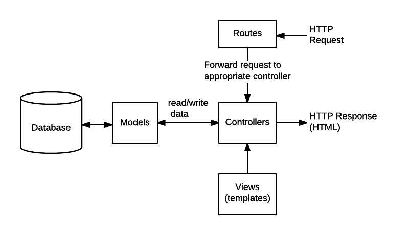
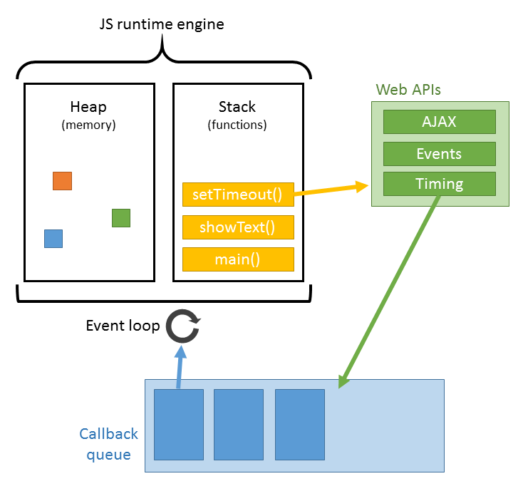
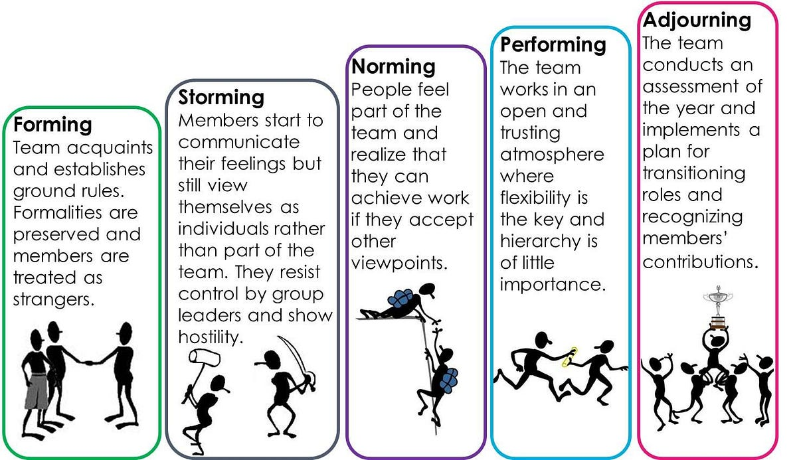

# Activities during the project sessions
 
> Please ensure that you have the following hierarchy in place. All activities should be located in `./dev/week3/Project`.

```sh
Dev
└── week3
    ├── Frontend
    ├── Backend
    ├── Project
    └── Reflection-Journal
```


### 2023-09-05

- Topics
  - Sprint 1 Review & Group presentation
  - MVC: Model view Controller
  - The Event Loop
  - Refactoring
- Activities
  - [Activity 1](./activity1.md)
  - [Activity 2](./activity2.md)


### 2023-09-07: 

- Topics
  - ~~Unit Testing~~
  - [SPA (Single-page application)](https://medium.com/@NeotericEU/single-page-application-vs-multiple-page-application-2591588efe58)
  - Asynchronous JavaScript
- Activities
  - [Activity 3](./activity3.md)
  - ~~[Activity 4](./activity4.md)~~


### Reading

- [The Fetch API is finally coming to Node.js](https://blog.logrocket.com/fetch-api-node-js/)
- [Using fetch](https://css-tricks.com/using-fetch/)
- [JS Promises](https://javascript.info/promise-basics)


### Misc.

Model View Controller


Event Loop


Bruce Tuckman's Forming, Storming, Norming, and Performing model


<!-- Links -->

