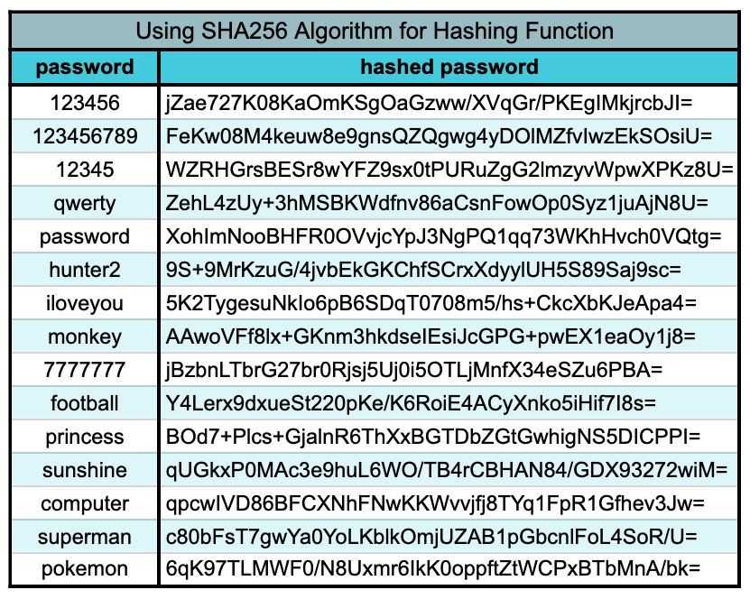

# Rainbow Table Attacks Tutorial

In this tutorial, we will delve into Rainbow Table Attacks. By the end of this article, you will be equipped to:

- Understand how a Rainbow Table Attack operates.
- Recognize actions, both for individuals and developers, that can mitigate Rainbow Table Attacks.

## Understanding Rainbow Table Attacks

Recall from Module Two that a hash table is a data structure that links inputs to their corresponding outputs. In a previous article, we explored how hashing functions transform plain-text inputs into distinct outputs. These input-output pairs, if exposed, can be stored using a hash table (commonly referred to as a Rainbow Table) to establish connections between plain-text passwords and their respective hashed representations.

If a malicious actor possesses a hash table containing leaked passwords and their corresponding hash values, they can employ this table to deduce plain-text user passwords, particularly those that are frequently used or repeated. Their process may unfold as follows:

1. Apply a hashing function to randomly generated potential passwords to obtain hash outputs.
2. Record both the plain-text password and its corresponding hash value in the hash table.
3. Repeat steps 1 and 2 with as many passwords as possible to amass a substantial dataset.

Consider an example of a rainbow table constructed using the SHA256 algorithm as the hashing function:

Subsequently, when the malicious actor gains access to leaked hashed passwords, they execute the following steps:

1. Compare each leaked hashed password with the hashed passwords stored in the hash table.
2. Upon finding a match, retrieve the corresponding plain-text password from the matched record.
3. Exploit the plain-text password to gain unauthorized access to the user's account.

This Rainbow Table Attack strategy capitalizes on the deterministic nature of hashing functions, as explained in the previous article. When identical inputs are provided to a hashing function, they will invariably yield identical outputs. Consequently, although reversing the hashing function itself is infeasible, inferring the input becomes possible when matching outputs are identified.

## Preventing Rainbow Table Attacks

Both developers and website users can take several measures to avert this threat.

### Developer Actions

- **Never Expose Hashed Passwords:** Developers must ensure that hashed passwords are never exposed to the client. Rainbow Table Attacks only succeed if malicious users gain access to leaked hashed passwords. Instances like the 2012 [LinkedIn breach] underscore the importance of this precaution. Developers can also implement additional security measures, such as password salting, which will be discussed in the next lesson.

### User Actions

- **Use Unique and Complex Passwords:** As a website user, it is crucial to employ distinct passwords for each website you access. Additionally, ensure that your passwords are not easily guessable. Rainbow Table Attacks can only compromise accounts when the input for a leaked password matches an entry in the hash table. Bear in mind that once an attacker gains access to your password for one website, all other accounts sharing that same password are also at risk of compromise.

This tutorial equips you with an understanding of Rainbow Table Attacks and provides actionable steps to safeguard against them. Implement these precautions to bolster your security and protect your online presence.

[LinkedIn breach]:https://blog.linkedin.com/2012/06/06/linkedin-member-passwords-compromised

## Ref

- appacademy.io